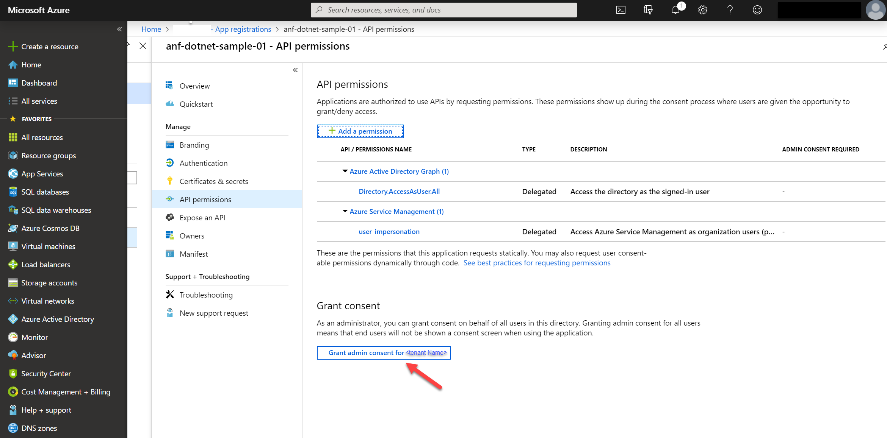
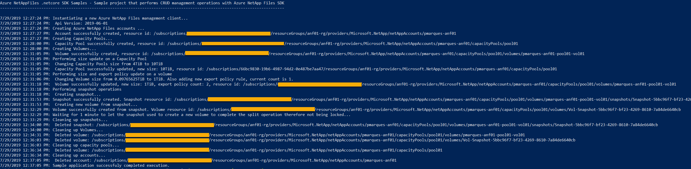

# Azure NetAppFiles SDK Sample for .NET Core

This project demonstrates how to use a dotnet-core sample application to perform CRUD management operations for Microsoft.NetApp resource provider.

In this sample application we perform the following operations:

* Creation
  * NetApp Files Accounts
  * Capacity Pools
  * Volumes
  * Snapshot
  * Volume from Snapshot
* Updates
  * Change a Capacity Pool size from 4TiB to 10TiB
  * Change a Volume size from 100GiB to 1TiB
  * Add a new NFS export policy to an existing volume
* Deletions
  * Snapshots
  * Volumes (including those created from Snapshots)
  * Capacity Pools
  * Accounts

>Note: The cleanup execution is disabled by default. If you want to run this end to end with the cleanup, please change value of boolean variable 'shouldCleanup' in program.cs.

Most of these operations are based on asynchronous programming model to demonstrate how to asynchronously manage Azure NetApp Files resources with dotnet-core, except for volume creation and deletion operations that are executed sequentially at the Resource Provider level, therefore these operations are executed sequentially. For more information about asynchronous programming using the Async/Await pattern, see [Asynchronous Programming with Async and Await (C# and Visual Basic)](https://docs.microsoft.com/previous-versions/hh191443(v=vs.140)).

If you don't already have a Microsoft Azure subscription, you can get a FREE trial account [here](http://go.microsoft.com/fwlink/?LinkId=330212).

## Prerequisites

1. Azure Subscription
2. Subscription needs to have Azure NetApp Files resource provider registered. For more information, see [Register for NetApp Resource Provider](https://docs.microsoft.com/en-us/azure/azure-netapp-files/azure-netapp-files-register).
3. Resource Group created
4. Virtual Network with a delegated subnet to Microsoft.Netapp/volumes resource. For more information, please refer to [Guidelines for Azure NetApp Files network planning](https://docs.microsoft.com/en-us/azure/azure-netapp-files/azure-netapp-files-network-topologies)
5. For this sample console application work, we need to authenticate and here we are providing two ways, one that uses service principals (default) or using device code flow authentication.
    1. For Service Principal based authentication
        1. Within an [Azure Cloud Shell](https://docs.microsoft.com/en-us/azure/cloud-shell/quickstart) session, make sure you're logged on at the subscription where you want to be associated with the service principal by default:
            ```bash
            az account show
           ```
             If this is not the correct subscription, use             
             ```bash
            az account set -s <subscription name or id>  
            ```
        1. Create a service principal using Azure CLI
            ```bash
            az ad sp create-for-rbac --sdk-auth
            ```

            >Note: this command will automatically assign RBAC contributor role to the service principal at subscription level, you can narrow down the scope to the specific resource group where your tests will create the resources.

        1. Copy the output content and paste it in a file called azureauth.json and secure it with file system permissions
        1. Set an environment variable pointing to the file path you just created, here is an example with Powershell and bash:
            Powershell 
            ```powershell
           [Environment]::SetEnvironmentVariable("AZURE_AUTH_LOCATION", "C:\sdksample\azureauth.json", "User")
            ```
            Bash
            ```bash
           export AZURE_AUTH_LOCATION=/sdksamples/azureauth.json
           ``` 
        1. By default the device flow based authentication code is commented out within the sample code and sample appsettings.json file, make sure that they are still commented out and that only service principal related code is uncommented at program.cs file.
        
        >Note: for more information on service principal authentication with dotnet, please refer to [Authenticate with the Azure Libraries for .NET](https://docs.microsoft.com/en-us/dotnet/azure/dotnet-sdk-azure-authenticate?view=azure-dotnet)
    1. For device flow authentication
     
        1. Make sure to comment out service principal authentication code at program.cs file and that all code related to device authentication flow is uncommented and finally that the authentication section of appsettings.json file has the client id and tenant id correctly defined.
        1. Create a new application within your Azure Active Directory Tenant:
            ```bash
            az ad app create --display-name anf-sdk-samples --native-app --reply-url http://localhost --required-resource-accesses @manifest.json

            ```

            **manifest.json contents**
            ```json
            [{
                "resourceAppId": "797f4846-ba00-4fd7-ba43-dac1f8f63013",
                "resourceAccess": [
                    {
                        "id": "41094075-9dad-400e-a0bd-54e686782033",
                        "type": "Scope"
                    }
                ]
            }]
            ```
        1. Take a note of the ApplicationID value and change the value on `clientID' setting at anf-dotnetcore-sdk-sample\appsettings.json configuration file
        1. If the user signing-in does not have permissions to consent to these permissions described within the manifest.json file, you should ask your Azure Active Directory Global Admin to apply these permissions for you before executing the console application.
       
            To pre-approve these assignments:
                1. Within Azure Active Directory, click "App registrations"
                1. Start typing the application name in the search field until you see the application name in the list
                1. Click the application name and select "Api permissions"
                1. The list of required api permissions will be shown and to grant consent, just click the "Grant admin consent for `<Azure AD Name>`" button.
                
        >Note: for more information on device flow authentication, please refer to [Azure Active Directory Device Flow Authentication full sample](https://aka.ms/msal-net-device-code-flow)

## What is anf-dotnetcore-sdk-sample.dll doing? 

Currently, Azure NetApp Files SDK exposes control plane management operations, CRUD operations for its resources like accounts, capacity pools, volumes and snapshots. We start this execution by reading a configuration file (appsettings.json). This file has three sections, one for authentication if you want to use the device code flow authentication (it can be ignored if working with service principal based authentication), the other section (general) has information about subscription and resource group to be used. The last section, (accounts), is the place that defines the accounts, capacity pools and volumes. This process will create a configuration object that is used extensively throughout the code to reference the resources to be created, updated and deleted.

>Note: Please refer to [Resource limits for Azure NetApp Files](https://docs.microsoft.com/en-us/azure/azure-netapp-files/azure-netapp-files-resource-limits) to understand ANF's most current limits.

Next, it will move forward to the authentication process, based on what type of authentication you want to use, generating a ServiceClientCredentials (service principal) or TokenCredentials (device flow) both accepted by AzureNetAppFilesManagementClient to create the management client, also used extensively throughout the code.

Then, it will start the CRUD operations by creating the accounts, capacity pools and volumes, in this exact sequence \(for more information about Azure NetApp Files storage hierarchy please refer to [this](https://docs.microsoft.com/en-us/azure/azure-netapp-files/azure-netapp-files-understand-storage-hierarchy) document\). After all resources are created, it will perform an update to a capacity pool by increasing its size; it will perform updates to a volume by changing its size quota and adding an extra export policy. Snapshot creation and creation of a new volume from this snapshot are the last operations before the clean up process that removes all resources deployed by this application.

>Note: This sample does not have a specific retrieve section since we perform gets and lists operations in several places throughout the code.

## How the project is structured

The following table describes all files within this solution:

| Folder         | FileName                 | Description                                                                                                                                                                                                                                                               |
|----------------|--------------------------|---------------------------------------------------------------------------------------------------------------------------------------------------------------------------------------------------------------------------------------------------------------------------|
| Root           | program.cs               | Reads configuration, authenticates, executes all operations                                                                                                                                                     |
| Root           | Creation.cs              | Static class that contains all resource creation loops following the hierarchy logic in order to successfully deploy Azure NetApp Files resources                                                                                                                         |
| Root           | Updates.cs               | Static class that is used to update capacity pool and volume sizes and to include a new export policy in a volume as well                                                                                                                                                 |
| Root           | Snapshots.cs             | Static class used for snapshot operations like creating a new snapshot and creating a new volume from snapshot                                                                                                                                                            |
| Root           | Cleanup.cs               | Static class that performs clean up of all artifacts resultant from execution of this sample console application. Its call is commented out by default at program.cs                                                                                                          |
| Root           | _sample-appsettings.json | This is the sample appsettings.json file, to use it, make a copy and rename to appsettings.json, by default the appsettings.json is included on .gitignore file to avoid unwanted extra information being committed to a public Git repo. Sizes are all defined in bytes. |
| Root\Common    | DeviceCodeFlow.cs        | Class that is used when performing authentication based on Device Code Flow                                                                                                                                                                                               |
| Root\Common    | ProjectConfiguration.cs  | Class used to create the configuration object based on appsettings.json file contents                                                                                                                                                                                     |
| Root\Common    | ResourceUriUtils.cs      | Static class that exposes some methods that helps parsing Uris, building a new Uris or getting a resource name from Uri for example                                                                                                                                       |
| Root\Common    | ServicePrincipalAuth.cs  | Small static class used when working with Service Principal based authentication                                                                                                                                                                                          |
| Root\Common    | Utils.cs                 | Static class that exposes a few methods that helps on various tasks, like getting the configuration object, authenticating when using Device Code flow authentication, etc.                                                                                               |
| Root\CommonSdk | CommonSdk.cs             | Static class dedicated to common operations related to ANF's SDK                                                                                                                                                                                                          |
| Root\Model     | *                        | Various .cs files that defines objects received from the configuration file or Azure AD Service Principal authentication file                                                                                                                                             |

## How to run the console application

1. Clone it locally
    ```powershell
    git clone https://github.com/Azure-Samples/netappfiles-dotnetcore-sdk-sample
    ```
1. Change folder to **.\netappfiles-dotnetcore-sdk-sample\src\anf-dotnetcore-sdk-sample**
1. Make a copy of **anf-dotnetcore-sdk-sample\\_sample-appsettings.json** file, rename it to **appsettings.json** and modify its contents accordingly (at minimum, all values between **\<\>** must be replaced with real values), change the authentication section only if using Device Code flow authentication method.
1. If using the default service principal authentication flow, make sure you have the azureauth.json and its environment variable with the path to it defined (as previously described)
1. Build the console application
    ```powershell
    dotnet build
    ```
1. Run the console application
    ```powershell
    dotnet run
    ```

Sample output


## References

* [Azure Active Directory Device Flow Authentication full sample](https://aka.ms/msal-net-device-code-flow)
* [Authenticate with the Azure Libraries for .NET](https://docs.microsoft.com/dotnet/azure/dotnet-sdk-azure-authenticate?view=azure-dotnet)
* [Resource limits for Azure NetApp Files](https://docs.microsoft.com/azure/azure-netapp-files/azure-netapp-files-resource-limits)
* [Azure Cloud Shell](https://docs.microsoft.com/azure/cloud-shell/quickstart)
* [Azure NetApp Files documentation](https://docs.microsoft.com/azure/azure-netapp-files/)
* [Download Azure SDKs](https://azure.microsoft.com/downloads/)

